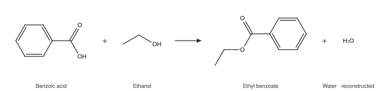

# omgkit

[](https://github.com/zbc0315/omgkit/actions/workflows/ci.yml)
[](https://pypi.org/project/omgkit/)

A cheminformatics toolkit written in Rust, with Python bindings.

[中文说明](README.zh-CN.md) · [Documentation](https://zbc0315.github.io/omgkit/)


<sub>Every structure on this page was drawn by omgkit itself — no other
chemistry library is involved. The code that produced them is
[`docs/figures/make_figures.py`](docs/figures/make_figures.py).</sub>

## What it does

| | |
|---|---|
| **SMILES** | Parsing and writing, with tetrahedral chirality, double-bond geometry, dative bonds and explicit hydrogens — plus canonical output |
| **Sanitization** | Valence, implicit hydrogens, ring perception, kekulization, aromaticity, conjugation, hybridization |
| **SMARTS** | Query parsing, substructure matching (optionally stereo-aware), and SMARTS writing for molecules and reactions |
| **Reactions** | Reaction templates, product generation, optional atom-atom mapping, intramolecular reactions |
| **Byproducts** | The water an esterification drops, rebuilt as a real molecule — or an explicit *cannot tell* when the record itself does not balance |
| **`.mol` / `.sdf`** | V2000 molblock and multi-record SDF, read and written, in 2D and 3D, with stereochemistry both ways |
| **2D depiction** | Coordinates and SVG/PNG/JPEG output in two drawing styles — with an explicit report of anything it could not draw well |
| **3D structures** | One deterministic conformer per molecule, no random seed and no retries, as a starting point for force-field refinement |
| **Batches** | A columnar `MolBatch` with zero-copy per-molecule views |

**Status: under development.** The API still changes between commits. Every
layer is checked record by record against an external reference implementation
(see [Correctness](#correctness)), but the surface is not yet stable enough for
production use. Bug reports are welcome.

## Install

```shell
pip install omgkit
```

One wheel covers Python 3.9 and up (built against the stable ABI), and there
are no system dependencies — nothing to `apt install`, no shared library to
find at runtime.

For Rust, take only the layers you need; each depends only on the ones below it.

```toml
[dependencies]
omgkit-core   = "0.0.2"   # data structures
omgkit-io     = "0.0.2"   # SMILES, SMARTS, .mol/.sdf
omgkit-chem   = "0.0.2"   # sanitization
omgkit-match  = "0.0.2"   # matching, reactions, byproducts
omgkit-depict = "0.0.2"   # 2D coordinates and drawing
omgkit-conf   = "0.0.2"   # 3D structure generation
```

## Getting started

```python
import omgkit

m = omgkit.parse_smiles("OC(=O)c1ccccc1N")
m.sanitize()
m.to_canonical_smiles()         # 'c1cccc(c1C(O)=O)N'

q = omgkit.parse_smarts("[CX3](=O)[OX2H1]")
q.match(m)                      # [[1, 2, 0]] — molecule indices, in query order

rxn = omgkit.parse_reaction("[C:1](=[O:2])[OH].[N:3]>>[C:1](=[O:2])[N:3]")
for outcome in rxn.run([acid, amine], atom_mapping=True, byproducts=True):
    outcome.products, outcome.reactants, outcome.byproducts
```

## Stereochemistry survives the round trip

A configuration written in a SMILES string comes back out of a drawing, a
`.mol` file, or a 3D structure as the same configuration.


```python
m = omgkit.parse_smiles("C[C@H](N)C(=O)O"); m.sanitize()
block = m.to_molblock_2d()                       # a wedge bond carries the configuration
back = omgkit.parse_molblock(block).mol

back.to_canonical_smiles() == m.to_canonical_smiles()    # True
# and the enantiomer does *not* collide with it, so that True means something:
d = omgkit.parse_smiles("C[C@@H](N)C(=O)O"); d.sanitize()
d.to_canonical_smiles() == m.to_canonical_smiles()       # False
```

## Reaction templates

A template describes the reaction centre; everything else in the molecule comes
along automatically.



```python
rxn = omgkit.parse_reaction("[C:1](=[O:2])[OH:3].[OH:4][C:5]>>[C:1](=[O:2])[O:4][C:5]")
out = rxn.run([benzoic_acid, ethanol], byproducts=True)[0]
[p.to_canonical_smiles() for p in out.products]      # ['CCOC(c1ccccc1)=O']
[b.to_canonical_smiles() for b in out.byproducts]    # ['O']
out.byproduct_verdict                                # 'capped'
```

**How many product molecules come out is decided by the graph, not by the
template.** A template rewrites one graph; the number of products is the number
of connected components that graph has afterwards. This is why applying a
template that cuts a ring bond does not silently duplicate atoms.

## Byproducts, and an explicit *cannot tell*

Reaction records generally write only the main product. The atoms a template
drops are recorded as fact (`discarded`), and can be closed into balanced
molecules by an atom-and-charge budget.


The answer comes with a verdict saying how much to trust it: `capped` (closed
by adding hydrogens only — no choices), `bonded(n)` (*n* extra bonds, which is a
heuristic), or `unresolved(reason)`. **When it is `unresolved`, no molecule is
returned** — a made-up one would be well-formed, sanitizable, and wrong.

What you get is the *formal* byproduct: the balanced molecule. For Boc
deprotection that is tert-butyl carbonic acid, not the carbon dioxide and
isobutylene you actually isolate. Decomposition needs a rule table, and mixing
a proven result with a guessed one in the same output makes them
indistinguishable.

## 3D structures, without the retries

`Mol.conformer()` generates one conformer per molecule for force-field
refinement to start from. **There is no random seed and no retry loop** — the
same molecule always gives the same coordinates.

```python
conf = omgkit.parse_smiles("C[C@H](N)C(=O)O").conformer()
conf.coords            # [(x, y, z), ...], Å, lined up with conf.mol
conf.chiral_ok, conf.chiral_total    # (1, 1) — every centre has the right sign
open("out.sdf", "w").write(conf.to_molblock(title="L-alanine") + "$$$$\n")
```

The usual approach samples one distance per atom pair independently from its
allowed interval, which routinely produces a table no 3D arrangement can
satisfy; the response is to discard the attempt and re-draw, up to `10×N` times.
When the cause is structural, all `10×N` retries fail the same way. omgkit keeps
the embedding and replaces that sampling step: after triangle smoothing, the
upper-bound matrix is *itself* a metric, so it is used directly as the reference
distance table.

On the same 8831-molecule corpus:

| | failures | notes |
|---|---:|---|
| RDKit ETKDGv3 2025.09.2 | 36 (0.41%) | mostly metal complexes |
| **omgkit** | **1 (0.01%)** | the one case has contradictory distance bounds |

## Drawing

Two styles are built in, both with every number taken from the ChemDraw 17.1
manual rather than tuned by eye. Output is SVG with no dependencies; PNG and
JPEG are behind the `raster` feature.

**The picture is decided by the molecule, not by how it was written.** Any
SMILES for the same structure gives point-for-point identical coordinates.

**What it cannot draw well, it says so.** Bridged and caged systems have no
good planar solution, so `Depiction` reports `degraded`, `unresolved`,
`crossings` and `unwedged` counts instead of quietly handing back a picture
whose configuration cannot be read.


## Correctness

Every claim above has a judge behind it, and each judge had to be shown to go
red when the behaviour is broken. The full suite (`TOTAL` in `harness/gates.sh`, **40** as of this writing) runs
on every push; the gates compare
omgkit against an external implementation record by record on a
8831-molecule corpus, and each one carries a floor as well as a cap so that it
cannot pass by being fed nothing.

  * [`harness/README.md`](harness/README.md) — how each judge is built, what it
    was measured at, and what it is known not to reach
  * [`docs/design.md`](docs/design.md) — what each layer does and why

## Documentation

  * [Documentation site](https://zbc0315.github.io/omgkit/) — guides and the
    Python API
  * `cargo doc --workspace --no-deps --open` — Rust API

## Contributing

Issues and pull requests are welcome. The full gate suite is one command:

```shell-session
$ bash harness/gates.sh
```

It needs a Python environment with the pinned RDKit
(`harness/requirements.lock`) because most gates compare against it. The five
Rust-only gates that CI also runs are:

```shell-session
$ cargo fmt --all --check
$ cargo clippy --workspace --all-targets -- -D warnings
$ cargo test --release
$ cargo test --workspace
$ cargo doc --workspace --no-deps --document-private-items
```

`cargo test` is green on a fresh clone: the smoke oracles are committed. The
large-corpus tier is marked `#[ignore]` and needs oracles you generate yourself
— see [`harness/README.md`](harness/README.md).

## License

Code released under the [BSD-3-Clause license](LICENSE).

Test corpora and the element table are redistributed from other projects and
carry their own terms; each file is traced to its origin in
[`THIRD-PARTY-NOTICES.md`](THIRD-PARTY-NOTICES.md).
