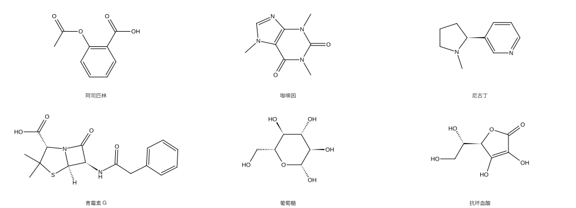
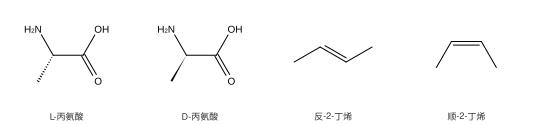
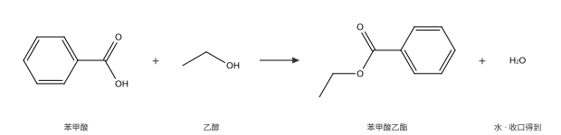
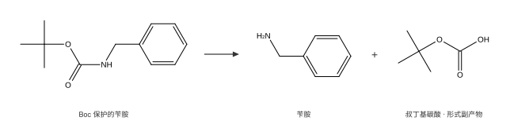
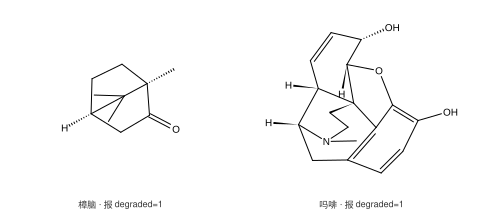

# omgkit

[](https://github.com/zbc0315/omgkit/actions/workflows/ci.yml)
[](https://pypi.org/project/omgkit/)

Rust 写的化学信息学工具箱,带 Python 绑定。

[English](README.md) · [文档站](https://zbc0315.github.io/omgkit/)



<sub>本页每一张结构式都是 omgkit 自己画的,没有借助任何别的化学库。出图的脚本是
[`docs/figures/make_figures.py`](docs/figures/make_figures.py)。</sub>

## 能做什么

| | |
|---|---|
| **SMILES** | 解析与写出,含四面体手性、双键顺反、配位键、显式氢;以及规范 SMILES |
| **净化** | 价、隐式氢、环感知、凯库勒化、芳香性、共轭、杂化 |
| **SMARTS** | 查询解析、子结构匹配(可选按立体判定),以及分子与反应的 SMARTS 写出 |
| **反应** | 反应模板、产物生成、可选的原子映射号、分子内反应 |
| **副产物** | 酯化丢掉的那个水,重建成真正的分子;记录本身配不平时**明说判不了**,而不是猜 |
| **`.mol` / `.sdf`** | V2000 molblock 与多记录 SDF,读写双向、二维三维都读立体 |
| **二维出图** | 坐标与 SVG/PNG/JPEG 输出,两套绘图规范;画不好的地方**如实报出来** |
| **三维构型** | 每个分子一个确定性构型,无随机种子、无重试,给后续力场优化当起点 |
| **批处理** | 列式 `MolBatch`,逐分子零拷贝视图 |

**状态:开发中。** 接口在提交之间仍会变。每一层都对外部实现逐条比对过
(见[正确性](#正确性)),但表面还没有稳定到可以用在生产上。欢迎提 issue。

## 安装

```shell
pip install omgkit
```

一个 wheel 覆盖 Python 3.9 及以上(按稳定 ABI 编译),没有任何系统依赖 ——
不用 `apt install` 什么东西,运行时也不去找共享库。

Rust 侧按需取层,每一层只依赖它下面的那些:

```toml
[dependencies]
omgkit-core   = "0.0.3"   # 数据结构
omgkit-io     = "0.0.3"   # SMILES、SMARTS、.mol/.sdf
omgkit-chem   = "0.0.3"   # 净化
omgkit-match  = "0.0.3"   # 匹配、反应、副产物
omgkit-depict = "0.0.3"   # 二维出图
omgkit-conf   = "0.0.3"   # 三维构型
```

## 上手

```python
import omgkit

m = omgkit.parse_smiles("OC(=O)c1ccccc1N")
m.sanitize()
m.to_canonical_smiles()         # 'c1cccc(c1C(O)=O)N'

q = omgkit.parse_smarts("[CX3](=O)[OX2H1]")
q.match(m)                      # [[1, 2, 0]] —— 分子原子号,按查询原子顺序给

rxn = omgkit.parse_reaction("[C:1](=[O:2])[OH].[N:3]>>[C:1](=[O:2])[N:3]")
for outcome in rxn.run([acid, amine], atom_mapping=True, byproducts=True):
    outcome.products, outcome.reactants, outcome.byproducts
```

## 立体化学经得住往返

SMILES 串里写的构型,画成图、写成 `.mol`、生成三维结构再读回来,还是那个构型。



```python
m = omgkit.parse_smiles("C[C@H](N)C(=O)O"); m.sanitize()
block = m.to_molblock_2d()                       # 构型写在一根楔形键上
back = omgkit.parse_molblock(block).mol

back.to_canonical_smiles() == m.to_canonical_smiles()    # True
# 而对映体不会撞上它 —— 否则上面那个 True 什么也说明不了:
d = omgkit.parse_smiles("C[C@@H](N)C(=O)O"); d.sanitize()
d.to_canonical_smiles() == m.to_canonical_smiles()       # False
```

## 反应模板

模板只描述反应中心,分子其余部分自动跟着走。



```python
rxn = omgkit.parse_reaction("[C:1](=[O:2])[OH:3].[OH:4][C:5]>>[C:1](=[O:2])[O:4][C:5]")
out = rxn.run([苯甲酸, 乙醇], byproducts=True)[0]
[p.to_canonical_smiles() for p in out.products]      # ['CCOC(c1ccccc1)=O']
[b.to_canonical_smiles() for b in out.byproducts]    # ['O']
out.byproduct_verdict                                # 'capped'
```

**出来几个产物分子由图决定,不由模板决定。** 模板重写的是一张图,产物数就是重写
之后这张图有几个连通分量。所以拿一个切断环键的模板去作用,不会悄悄把原子复制一份。

## 副产物,以及一句明说的"判不了"

反应记录普遍只写主产物。模板丢掉的原子被如实记成事实(`discarded`),再靠一本
原子账与电荷账收口成配平的分子。



答案附带一句结论,说明能信到什么程度:`capped`(只补氢就闭合,没有任何选择余地)、
`bonded(n)`(还成了 n 根键,成在哪两个原子之间是启发式)、`unresolved(原因)`。
**结论是 `unresolved` 时一个分子都不给** —— 编出来的那个拓扑合法、能净化,只是错的。

给的是**形式副产物**,也就是账平且价键填满的那个分子。Boc 脱保护的形式副产物是
叔丁基碳酸,不是实际拿到的二氧化碳加异丁烯。分解要靠一张规则表,那是另一件事:
形式副产物有硬判据(原子账与电荷账精确闭合),分解规则没有,混在一个输出里就
再也分不清哪个是证出来的、哪个是猜的。

## 三维构型,不靠重试

`Mol.conformer()` 给每个分子生成一个构型,交给后续力场优化当起点。
**没有随机种子,也没有重试循环** —— 同一个分子永远同一组坐标。

```python
conf = omgkit.parse_smiles("C[C@H](N)C(=O)O").conformer()
conf.coords            # [(x, y, z), ...],单位 Å,与 conf.mol 的原子表对齐
conf.chiral_ok, conf.chiral_total    # (1, 1) —— 每个中心的号都对
open("out.sdf", "w").write(conf.to_molblock(title="L-丙氨酸") + "$$$$\n")
```

通行的做法是在每一对原子各自的区间里**独立**随机取一个距离,取出来的表往往任何
三维摆法都满足不了;应对是作废整次尝试重掷,最多 `10×N` 次。而当病因是结构性的
时候,`10×N` 次会以同样的方式全部失败。omgkit 保留嵌入,只换掉取样那一步:
三角光滑化之后的上限矩阵**本身就是一个度量**,直接拿它当参考距离表。

同一份 8831 个分子的语料上:

| | 失败数 | 说明 |
|---|---:|---|
| RDKit ETKDGv3 2025.09.2 | 36(0.41%) | 多数是金属配合物 |
| **omgkit** | **1(0.01%)** | 那一个的距离界本身自相矛盾 |

## 出图

内置两套规范,每一个数都取自 ChemDraw 17.1 手册,不是照着眼睛调的。SVG 输出零依赖,
PNG 与 JPEG 在 `raster` feature 后面。

**图由分子决定,不由它被写成什么样决定。** 同一个结构的任何 SMILES 写法给出逐点
全等的坐标。

**画不好的地方它会说出来。** 桥环、笼状体系在平面上没有好解,那时 `Depiction`
报出 `degraded`、`unresolved`、`crossings`、`unwedged` 四个计数,而不是默默交一张
构型读不出来的图。



## 正确性

上面每一句话背后都有一条判据,而且每条判据都先被证明过"行为坏掉时它会变红"。
整套闸(条数以 `harness/gates.sh` 里的 `TOTAL` 为准,写这段时是 **40**)在每次
推送时跑一遍:在 8831 个分子的语料上逐条与外部实现比对,
每一条都同时配了上限与下限 —— 免得喂空了也照样绿。

  * [`harness/README.md`](harness/README.md) —— 每条判据怎么搭的、量到多少、
    以及它已知够不着哪一档
  * [`docs/design.md`](docs/design.md) —— 每一层做什么、为什么这么做

## 文档

  * [文档站](https://zbc0315.github.io/omgkit/) —— 指南与 Python API
  * `cargo doc --workspace --no-deps --open` —— Rust API

## 参与

欢迎提 issue 与 PR。整套闸门是一条命令:

```shell-session
$ bash harness/gates.sh
```

它需要一个装了钉住版本 RDKit 的 Python 环境(`harness/requirements.lock`),
因为多数判据要与它比对。CI 同时跑的那五道纯 Rust 闸是:

```shell-session
$ cargo fmt --all --check
$ cargo clippy --workspace --all-targets -- -D warnings
$ cargo test --release
$ cargo test --workspace
$ cargo doc --workspace --no-deps --document-private-items
```

新克隆下来 `cargo test` 就是绿的:冒烟档的真值已经提交进仓库。大语料那一档标了
`#[ignore]`,要自己生成真值 —— 见 [`harness/README.md`](harness/README.md)。

## 许可

代码按 [BSD-3-Clause](LICENSE) 发布。

测试语料与元素表转载自其他项目,各自带着自己的条款;每个文件的出处都记在
[`THIRD-PARTY-NOTICES.md`](THIRD-PARTY-NOTICES.md)。
