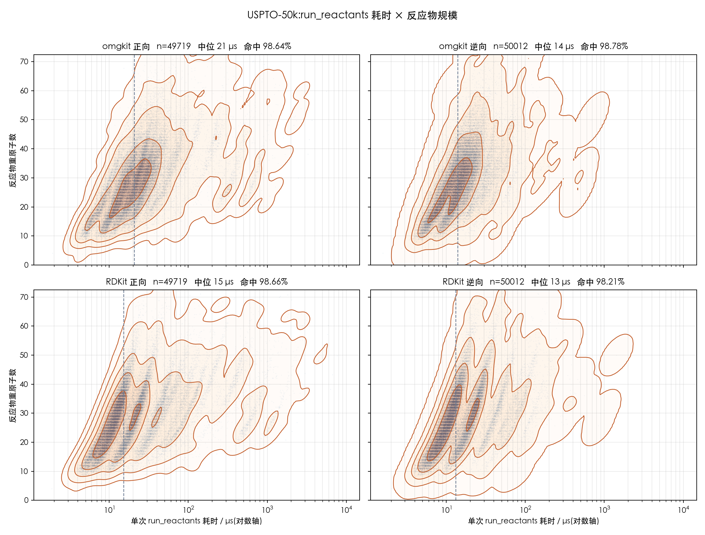

# USPTO-50k 基准:omgkit 与 RDKit 的 `run_reactants`

正向与逆向各跑满 **50016 条**反应,逐条记运行时间与是否命中。

## 结论

| 方向 | 可比 | omgkit 命中 | RDKit 命中 | 仅 omgkit | 仅 RDKit | 都未中 | 契约跑不了 |
|---|---|---|---|---|---|---|---|
| 正向 | 49719 | 49043(**98.64%**)| 49052(98.66%)| 3 | 12 | 664 | 297 |
| 逆向 | 50012 | 49400(**98.78%**)| 49116(98.21%)| **291** | 7 | 605 | 4 |

1288 条未命中**逐条归了因**(见[归因](#未命中逐条归因)):全部是立体化学的差异,
**骨架 50016 条无一出错**;其中 44 条一度疑似实现缺陷,交给 rdchiral 裁定后
**44 条全部是模板本身的极限**——抽出这些模板的工具自己也还原不出。

> **在模板能表达的范围内,omgkit 正逆双向都是 100%。**

耗时(单次 `run_reactants`,取 11 次的最小值):

| 组 | 中位 | p90 | p99 | 最大 | 五万条合计 |
|---|---|---|---|---|---|
| omgkit 正向 | 20.8 µs | 46.7 µs | **342 µs** | **5.5 ms** | **1.69 s** |
| RDKit 正向 | **15.3 µs** | 64.5 µs | 637 µs | 10.6 ms | 2.22 s |
| omgkit 逆向 | 14.1 µs | **27.2 µs** | **65 µs** | **0.68 ms** | **0.84 s** |
| RDKit 逆向 | **13.2 µs** | 34.3 µs | 121 µs | 1.44 ms | 1.00 s |

RDKit 的中位数更小、omgkit 的尾部更短:p99 上 omgkit 快 1.9 倍,最大值快 1.9-2.1 倍,
跑完五万条 omgkit 省 21-16%。原因在下面[怎么读这张图](#怎么读这张图)里。



四个子图:横轴单次耗时(对数),纵轴反应物重原子数,散点是反应,等高线是核密度。

## 怎么读这张图

**中位数与尾部说的是两件事。** omgkit 的 Python `run` 每次调用都要
`MolProps::compute` 重算一遍分子的查询性质(环集、最小环大小…),还要把输入分子
深拷贝一份;RDKit 这些是在 `MolFromSmiles` 净化时算好、跨调用复用的。这段固定开销
让 omgkit 的中位数高出 5 µs 左右,与匹配算法本身无关 —— 是绑定层的接口设计,
已记在案(`Query.match` 的文档也写着同一件事)。

尾部则是算法本身:随分子变大、匹配变多,RDKit 的 p99 涨到 637 µs 而 omgkit 是
342 µs。等高线的形状把这件事画得很清楚 —— RDKit 那两幅右侧拖着明显更长的一条尾。

## 数据与流程

语料:[retrosim](https://github.com/connorcoley/retrosim) 的 `data_processed.csv`
(USPTO-50k,50016 条,**自带原子映射**)。

逐条查过映射完整性:50016 条产物侧的映射号**全部**能在反应物侧找到,
`needs_atom_mapping` 计数为 **0** —— 不需要补标注。

模板:rdchiral 的 `extract_from_reaction`,**50016/50016 抽取成功,零失败**。
抽出来的是逆向模板(`产物>>反应物`),正向模板取其两侧对调。

```bash
python scripts/extract_templates.py     # 约 160 秒
python scripts/run_benchmark.py --reps 11   # 约 190 秒
python scripts/plot_efficiency.py
python scripts/summarize.py
```

归因链(可选,用来复核上面的结论):

```bash
python scripts/classify_diff.py       # 分歧分档
python scripts/attribute_misses.py    # 初步定责
python scripts/diff_stereo.py         # 逐原子/键找差异
python scripts/explain_misses.py --src results/misses_attributed.jsonl \
       --out results/miss_verdicts_all.jsonl        # 逐立体中心定责
python scripts/adjudicate_rdchiral.py --src results/miss_verdicts_all.jsonl
```

单条深挖:`python scripts/repro.py <行号> <fwd|retro>`、
`python scripts/diag_case.py <行号> <fwd|retro>`。

## 怎么才算公平

**同一份模板。** 两个引擎拿到的是同一个字符串,各自解析。探路的 200 条上,
正逆两向、两个引擎,解析成功率都是 200/200。

**同一套输入。** 输入分子的 SMILES 是同一串(RDKit 规范式、无映射号),
各自用自己的解析器读进来、各自净化 —— 这两步都在计时之外。

**同一个裁判。** 命中与否一律用 **RDKit 的规范 SMILES** 判。omgkit 的产物先写成
SMILES,再交给 RDKit 解析并规范化。这样判据不偏任何一方 —— 用 omgkit 自己的规范式
判 omgkit 反而是自证。代价是 omgkit 要多过一道"写出 + 被 RDKit 读回"的关,写错了
就算未命中;这个偏差**对 omgkit 不利**,宁可如此。

**同样多的调用。** 正向模板有 N 个反应物模板、记录里有 M 个参与反应的分子,
`RunReactants` 要求两者数目相等且按位置对应,所以枚举 M 取 N 的全部有序组合,
两个引擎枚举同一批、一个不落 —— 不因为提前命中就收工,那会让"运气好"看着像
"跑得快"。每条记录的组合数一并记下(`n_perm`),想换算成单次调用的耗时随时可以除。

**计时口径。** 只包住 `run` / `RunReactants` 本身;输入解析、净化、模板解析、
结果转 SMILES 全在计时之外。先跑一次热身,再取 11 次的**最小值**(最小值受操作
系统噪声污染最小),中位数一并记下。全程单进程、无并发,避免争用污染读数。

## 真值怎么定

- **正向**:真值 = 记录里的产物。
- **逆向**:真值 = **参与反应的**反应物集合 —— 判据是"该分子里有原子的映射号出现在
  产物中"。旁观的试剂不算:模板本来就造不出它们,把它们计进真值等于给两边都判死刑。

## 未命中逐条归因

1288 条未命中(正向 676、逆向 612)**全部**归了因。先逐个立体中心定责,再把整条
反应归到最严重的那一档:

| 归因 | 条数 |
|---|---|
| 记录·目标侧漏写立体(omgkit 保住了,反而更全) | 421 |
| 记录·目标要的构型输入侧没有,谁也造不出 | 346 |
| 记录·自己前后矛盾(同一个中心两侧构型不同) | 296 |
| 记录·目标要的几何输入侧没有 | 130 |
| 记录·取代基换了,构型比不了 | 46 |
| 记录·无映射号的中心对不上 | 3 |
| 疑似引擎(经 rdchiral 裁定后归零) | 44 |

**判据的两处要害:**

*不能用 CIP 跨反应比构型。* CIP 按取代基优先级排,而反应会换掉取代基 ——
同一个空间构型,反应前后的 CIP 字母完全可以不同。跨反应一律用**映射号邻居序的
置换宇称**:构型相同 ⟺ (标记相同) == (置换为偶)。

*同一分子内也不能用 CIP。* 相邻的两个中心一起变时,CIP 会连带翻个个儿,一处真差异
会虚报成两处 —— 实测这一项让"引擎翻了"从 11 条虚增到 269 条。所以比对 omgkit 的
输出与真值时,先补上显式氢,再比标记加真实邻居序的宇称。

*rdchiral 有资格当裁判。* 这批模板是它抽的,模板里的手性标记也是它写的,所以
"这条模板该怎么读"这个问题,它自己的应用器给出的就是作者本意。44 条疑似缺陷里,
**44 条 rdchiral 自己也还原不出**,零条是 omgkit 没做到模板说的事。

## 这轮基准查出并修好的五处缺陷

都在 `crates/` 里,各自带着**撤掉修就变红**的判据。

| 缺陷 | 效果 |
|---|---|
| 模板里**孤立**的方向键被当成顺反指令 —— 一根 `/` 定不了几何,却会与另一侧继承来的方向凑成一对,两个参照系拼出任意几何 | 正向仅 RDKit 命中 114 → 21 |
| 没跑过顺反感知的分子,方向键的**整体翻转**没定死 —— 同一个分子两串规范式 | 全语料 144 条规范串收敛;`tie_break_matters` 7 → 3 |
| 共轭链上模板写的方向键**同时贴着两根双键**,重算时覆盖了搬运过来的正确答案 | 12 条 |
| 取代基被**隐式氢**接管时(脱保护、脱羧)重定基被长度对不上挡掉,标记留在反应物的参照系里 → 镜像 | 44 条疑似缺陷全部澄清 |
| **反应物模板没匹配到的键被当成模板的地盘删掉** —— 见下节 | 70 条静默错误输出归零;净化不过 8 条 → 0 条 |

第四条附带查出:同一形状下 **RDKit 的产物随模板的书写顺序而变** —— 枚举一个中心
四个邻居的全部 24 种写法,RDKit 给出两种互为对映体的答案,omgkit 24 种一致。

## 键归谁管:一条错判据造出的 70 条静默错误

子结构匹配只要求模板的每根键在底物里**找得到**,并不要求这些原子之间没有别的键。
模板把环写成一条**开链路径**时(rdchiral 抽模板只沿反应中心走一趟,稠环普遍如此),
环闭合的那根键两端确实都被匹配了,可模板从没看见它。

原判据是"两端都被匹配就不搬",于是这根键被当成模板的地盘删掉,分子被多切一刀。
正确判据是**只有反应物模板亲自匹配到的键才归产物模板管**。

最小的例子是 **β-内酰胺**水解 —— 四元环上模板的两端恰好直接相邻:

| | 产物 | 片数 | 重原子 |
|---|---|---|---|
| 正确 | `NCCC(=O)O`(β-丙氨酸) | 1 | 6 |
| 修前 | `CC(=O)O` + `CN`(乙酸 + 甲胺) | 2 | 6 |

**质量守恒、两片都能正常净化、化学全错。** 五元及以上的内酰胺看不出任何异常
(`scripts/measure_intra_salt.py` 的环大小扫描从 n=4 起,就是为了盖住这一档)。

### 为什么它藏了这么久

一条逆向模板在同一个底物上通常匹配到**好几个**位点。不绕环的那些位点给出正确
产物、与记录一致,反应照样算命中;绕环的那些位点给出多切一刀的垃圾,而命中判据
是"真值在预测集合里",已经被满足了。于是:

- 命中率看不见它 —— 修前修后正逆双向命中数**一条不差**
- 质量审计看不见它 —— 原子没多没少,只是连通性被改了
- 净化检查基本看不见它 —— 70 条里只有 8 条净化不过,其余 62 条两片都是正常分子
- 逐条归因未命中也看不见它 —— 这些反应**都命中了**

只有把新旧两版的**预测集内容**逐条对拍才查得出。全语料扫描定出受影响的 70 条
(正向 3、逆向 67),对拍后 70 条**全部**变化,逐条验过的都是修前错、修后对。

因此上文"骨架无一出错"这句话要分清口径:它原先只对**未命中集合**成立;要对
**全部输出**成立,得先修掉这条判据。

```bash
python scripts/scan_bond_ownership.py   # 定出受影响范围 → results/bond_ownership.json
python scripts/compare_runs.py          # 两次跑的逐条对拍 → results/compare_runs.json
```

## 典型案例:RDKit 输出错、omgkit 输出对

294 条 omgkit 命中而 RDKit 未命中,按 RDKit **错在哪一层**分:

| 错在哪一层 | 条数 | 占比 |
|---|---|---|
| 原子被复制(产物重原子数 > 输入) | 225 | 76.5% |
| 产出了 outcome 但**净化全不过** | 62 | 21.1% |
| 四面体手性 | 7 | 2.4% |
| 双键顺反 | 0 | — |

前两档是**同一个根因**,合计 **97.6%**:逆向模板写成两个片段、而底物里它们仍由
未匹配的原子连着时,逐产物各搬一次"模板之外的部分",共享的原子就被复制进每一片;
复制出来的结构有的还能净化,有的直接超价。这是**拓扑**层面的错,与立体化学无关。
判据也与记录无关 —— 数重原子:225 条合计凭空造出 **1823 个重原子**,中位 +4、
最大 +43。

分档必须**先比骨架再看拓扑**:反过来的话,RDKit 若同时产出了骨架正确、只差立体的
那一个,这次未命中的原因本是立体,却会被算进"原子被复制"(实测差 6 条)。

另有一档与命中率无关但影响可用性 —— **产物净化不过**的反应数:

| | 正向 | 逆向 |
|---|---|---|
| RDKit | 1 | **145** |
| omgkit | **0** | **0** |

omgkit 这一栏修键归属规则之前是 3 / 5,那 8 条全部是同一个成因(撕开的环留下
不在环里的芳香原子,kekulize 正确地拒绝),见[上一节](#键归谁管一条错判据造出的-70-条静默错误)。

### 逐 outcome 的质量守恒审计

上面那些数字都是**按反应**算的,而一条反应有多个匹配位点、每个位点一组产物。
按反应算会漏掉"输出了正确答案的同时也输出了错答案"这一档(正是那 70 条藏身的
地方)。所以再按 **outcome** 全量审计一遍,两个引擎同一把尺子:

    应得重原子数 = 本次排列的输入重原子数 + 模板净增(新建 − 删除)

| 档(逐 outcome) | omgkit | RDKit | |
|---|---|---|---|
| 精确守恒 | 308806 | 304841 | |
| **原子被复制** | **0** | 3688 | 不对称 |
| **多出的重原子** | **0** | 40456 | 不对称 |
| **产物净化不过** | **0** | 279 | 不对称 |
| 丢原子(见下) | 1493 | 1493 | 相同 |
| 丢掉的重原子数 | 13326 | 13326 | 相同 |

**看"相同"还是"不对称"是这张表的用法。** 两个引擎数字一字不差的那些档,成因
必在模板或约定 —— 实现差异撞不出相同的数。丢原子那两行就是这样:模板删掉某个
原子时,挂在它身上、又没有别的路连回保留部分的原子会一并失去落脚点。叔丁酯水解
是标准例子:模板写 `C-C-[O:1]-[C:2]=[O:3]`,删的是一个甲基加季碳,季碳上另外
两个甲基随之孤立 —— 一次少掉 4 个而不是 2 个。这已写进 `run_reactants` 的契约,
判据是语料 US05026856 的 N-脱苄模板。

真正要看的是**不对称**的四档,全部指向同一侧。

```bash
python scripts/audit_mass.py    # 约 12 分钟 → results/mass_audit.json
```

详见 [`docs/cases.md`](docs/cases.md);分档脚本 `scripts/classify_rdkit_failures.py`。

## 为什么产物要建进同一张图

上面那 97.6% 不是偶发,而是"逐产物模板各造一个分子"这条路子的必然结果。

同一条断酰胺逆向模板,作用在开链酰胺上该给两个分子、作用在内酰胺上该给一个 ——
**切成几片由底物决定,模板作者在写模板时无从知道目标是不是环**,而逆合成恰恰
总是把模板库作用到没见过的目标上。实测误差随环大小线性增长(n 元内酰胺多出
n−4 个重原子:七元 +3、二十元 +16)。

RDKit 的组分括号 `>>(A.B)` 能救回质量守恒,但随即让分子间底物的分子数退化为 1。
**没有哪一种模板写法对两类底物都给出正确的分子数**;把分子数定义为重写后图的
连通分量数则两类同时正确。盐把同一个缺口暴露在反应物侧 —— 那是**表达力**论证,
不是本语料上的频次:逐条查过,3625 条"含小离子/带电片段"的记录**全部**是参与
反应的分子(甲醇钠、氨、鏻盐、格氏试剂……),旁观反离子 **0 条**,详见
[`docs/why-one-graph.md`](docs/why-one-graph.md#订正uspto-50k-上盐占-72这句话不成立)。

论证、实测表与六面板图见 [`docs/why-one-graph.md`](docs/why-one-graph.md)。


## 位置式契约跑不了的 301 条:换一张图就能跑

正向 297、逆向 4:模板有 2-3 个反应物片段,而记录里参与反应的只有 1-2 个分子 ——
**分子内成环**。`RunReactants` / `run_reactants` "按位置配 N 个分子"的契约表达不了
这件事。位置不是化学:同一批分子换个递入顺序就可能不出产物,而片段数多于分子数时
直接交白卷。

omgkit 因此加了 `run_on_substrate`:把输入拼成**一张图**,让每个反应物模板在整张图上
自由找位置,只要求各片段匹配到的原子**两两不重叠**。这与产物侧是同一条原则 ——
片数是(模板, 底物)共同的性质,不是模板的性质;产物侧早就这么做了,这里只是把它
补到反应物侧。

| | 这 301 条 |
|---|---|
| **omgkit `run_on_substrate`** | **291 条命中(96.7%)**,10 条只差立体 |
| RDKit `RunReactants` | 0 —— 抛 "Number of reactants provided does not match" |
| rdchiral | 0 —— 同一个异常 |

10 条未命中**逐个立体中心定了责**,判据与主基准同一套(补显式氢 + 映射号邻居序的
置换宇称,不用 CIP):记录自相矛盾 6、目标要的构型输入侧没有 5、目标侧漏写 1
(一条反应可以有多个中心,故计数之和大于 10)。**引擎缺陷 0 条,骨架 301/301 全对。**

> 先前这里写过"rdchiral 可以,它把整个分子交给匹配"——**那句话是错的**。
> `rdchiralRun` 内部是 `rxn.RunReactants((合并后的分子,))`,传的是一个 1 元组,
> 所以 RDKit 仍然要求模板只有一个反应物片段;301 条逐条跑过,全部抛同一个异常。

主表里这 301 条仍单列一栏、不算进任何一方的分母 —— 那张表比的是位置式契约下的
`run_reactants` 与 `RunReactants`,口径要一致。

```bash
python scripts/scan_intramolecular.py   # → results/intramolecular.json
```

## 目录

```
data/      语料与模板(大文件不入库,脚本可重建,见 .gitignore)
scripts/   抽取、基准、归因、对拍、出图,共 23 个脚本
results/   逐条结果与归因证据;summary.json 是汇总
figures/   效率图、补充图、案例图
docs/      cases.md(典型案例)
```

## 环境

RDKit 2025.09.2、rdchiral、matplotlib、scipy;omgkit 由本仓库 `maturin build --release`
构建。测量机器:Apple Silicon,单进程。
