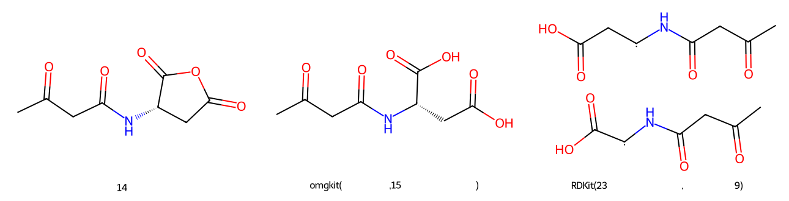
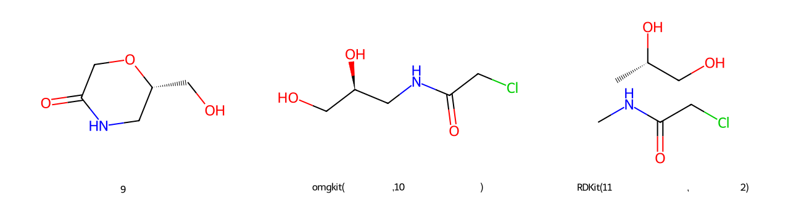
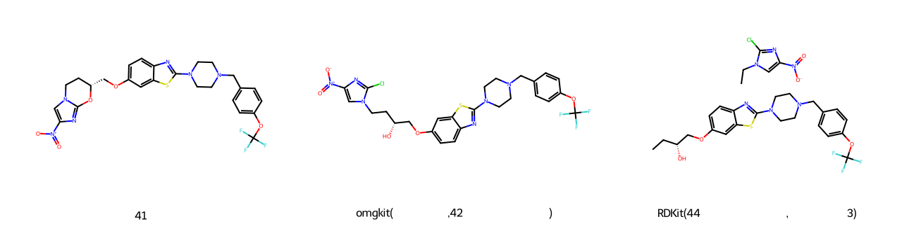
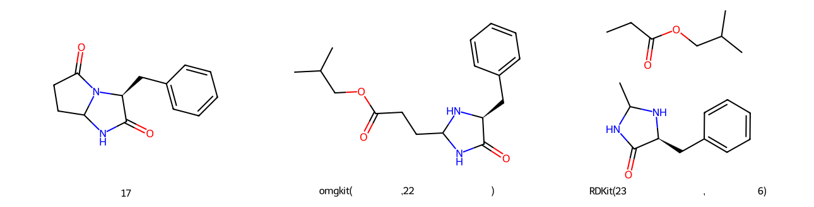
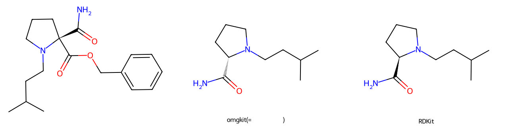

# 典型案例:RDKit 输出错、omgkit 输出对

判据不依赖记录 —— 见 `scripts/make_cases.py` 的模块说明。

全量 50016 条里,omgkit 命中而 RDKit 未命中的共 **294** 条,
其中质量不守恒 231 条、立体差异 1 条、其他 0 条。

## 一、RDKit 把共享的原子复制进了每一个产物片段

逆向模板写成两个片段,而底物里这两个片段仍由**未被模板匹配**的原子连着
(分子内成环的逆向就是这样)。逐产物各搬一次"模板之外的部分",共享的那批
原子就被复制进每一片 —— 产物的重原子数**多于**底物,而没有任何东西报错。

判据与记录无关:数重原子。

### 1. `US04555362` (row 284, retro)

- 模板 `[C:2]-[C;H0;D3;+0:1](=[O;D1;H0:3])-[O;H0;D2;+0:6]-[C:5]=[O;D1;H0:4]>>O-[C;H0;D3;+0:1](-[C:2])=[O;D1;H0:3].[O;D1;H0:4]=[C:5]-[OH;D1;+0:6]`
- 输入 `CC(=O)CC(=O)N[C@H]1CC(=O)OC1=O` —— 14 个重原子
- omgkit `CC(=O)CC(=O)N[C@@H](CC(=O)O)C(=O)O` —— 15 个重原子 ✅ 守恒
- RDKit `CC(=O)CC(=O)N[CH]C(=O)O.CC(=O)CC(=O)N[CH]CC(=O)O` —— 23 个重原子 ❌ **多出 9 个**



### 2. `US08058045B2` (row 304, retro)

- 模板 `[#7:3]-[C:2](=[O;D1;H0:4])-[CH2;D2;+0:1]-[O;H0;D2;+0:6]-[C:5]>>Cl-[CH2;D2;+0:1]-[C:2](-[#7:3])=[O;D1;H0:4].[C:5]-[OH;D1;+0:6]`
- 输入 `O=C1CO[C@H](CO)CN1` —— 9 个重原子
- omgkit `O=C(CCl)NC[C@H](O)CO` —— 10 个重原子 ✅ 守恒
- RDKit `CNC(=O)CCl.C[C@H](O)CO` —— 11 个重原子 ❌ **多出 2 个**



### 3. `US09051333B2` (row 351, retro)

- 模板 `[#7;a:2]:[c;H0;D3;+0:1](:[#7;a:3])-[O;H0;D2;+0:5]-[C:4]>>Cl-[c;H0;D3;+0:1](:[#7;a:2]):[#7;a:3].[C:4]-[OH;D1;+0:5]`
- 输入 `O=[N+]([O-])c1cn2c(n1)O[C@@H](COc1ccc3nc(N4CCN(Cc5ccc(OC(F)(F)F)cc5)CC4)sc3c1)CC2` —— 41 个重原子
- omgkit `O=[N+]([O-])c1cn(CC[C@@H](O)COc2ccc3nc(N4CCN(Cc5ccc(OC(F)(F)F)cc5)CC4)sc3c2)c(Cl)n1` —— 42 个重原子 ✅ 守恒
- RDKit `CC[C@@H](O)COc1ccc2nc(N3CCN(Cc4ccc(OC(F)(F)F)cc4)CC3)sc2c1.CCn1cc([N+](=O)[O-])nc1Cl` —— 44 个重原子 ❌ **多出 3 个**



### 4. `US05053422` (row 384, retro)

- 模板 `[C:2]-[C;H0;D3;+0:1](=[O;D1;H0:3])-[N;H0;D3;+0:8]1-[C:7]-[#7:6]-[C:5](=[O;D1;H0:4])-[C:9]-1>>C-C(-C)-C-O-[C;H0;D3;+0:1](-[C:2])=[O;D1;H0:3].[O;D1;H0:4]=[C:5]1-[#7:6]-[C:7]-[NH;D2;+0:8]-[C:9]-1`
- 输入 `O=C1NC2CCC(=O)N2[C@H]1Cc1ccccc1` —— 17 个重原子
- omgkit `CC(C)COC(=O)CCC1NC(=O)[C@H](Cc2ccccc2)N1` —— 22 个重原子 ✅ 守恒
- RDKit `CC1NC(=O)[C@H](Cc2ccccc2)N1.CCC(=O)OCC(C)C` —— 23 个重原子 ❌ **多出 6 个**



## 二、立体:骨架一样,RDKit 给出的是对映体

### 1. `US05620987` (row 2589, fwd)

- 模板 `O=C(-O-C-c1:c:c:c:c:c:1)-[C@;H0;D4;+0:1](-[C:2](-[N;D1;H2:3])=[O;D1;H0:4])(-[#7:5])-[C:6]>>[#7:5]-[C@H;D3;+0:1](-[C:2](-[N;D1;H2:3])=[O;D1;H0:4])-[C:6]`
- 输入 `CC(C)CCN1CCC[C@]1(C(N)=O)C(=O)OCc1ccccc1`
- omgkit `CC(C)CCN1CCC[C@H]1C(N)=O` ✅ 与记录一致
- RDKit `CC(C)CCN1CCC[C@@H]1C(N)=O` ❌ 骨架相同,立体不同



## 三、RDKit 的产物随模板的**书写顺序**而变

同一个连接关系,模板把同样几个邻居换个次序写,描述的仍是同一个产物。
下面枚举一个中心的四个邻居的全部 24 种写法,底物固定:

```
模板  [C:2]-[CH;D3;+0:1](-[N:3])-[O:4] >> <四个邻居的某种写法>
底物  C[C@H](N)O
```

- omgkit:24 种写法给出 **1** 个不同产物 —— ['C[C@](N)(O)Cl']
- RDKit :24 种写法给出 **2** 个不同产物 —— ['C[C@@](N)(O)Cl', 'C[C@](N)(O)Cl']

同一个产物不该因为模板作者的书写顺序而变成对映体。

