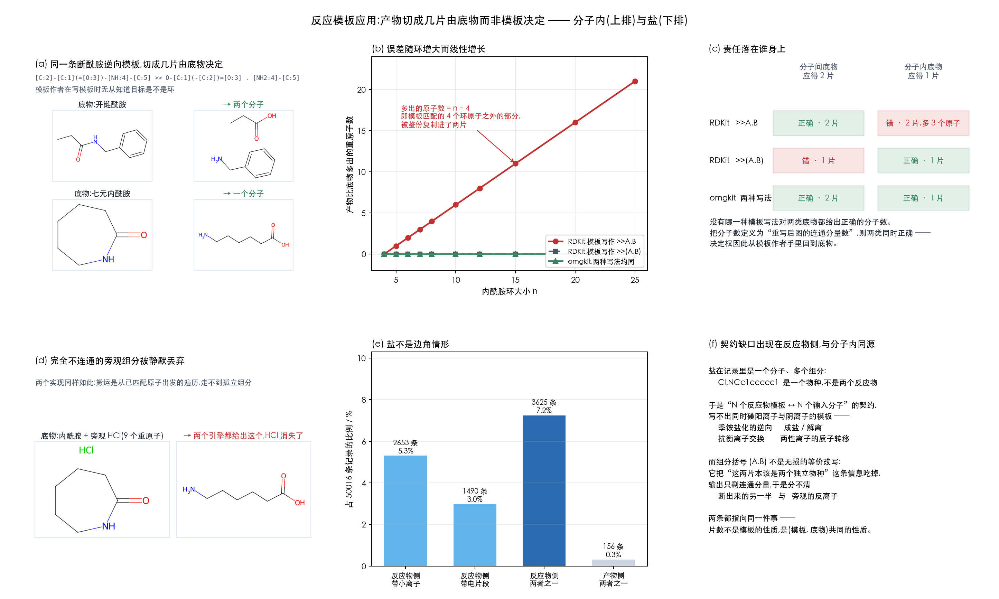

# 为什么产物要建进同一张图

模板应用是对底物的**一次整体图重写**,不是"逐个产物模板各造一个分子"。

按后者实现,共享的原子会被搬进每一片,质量当场不守恒。这份文档给出两条论证与
它们的实测支撑,合成一张图:[`figures/intra_and_salt.png`](../figures/intra_and_salt.png)。



## 论点 A:切成几片,由底物决定,模板作者预先不可知

同一条断酰胺的逆向模板

```
[C:2]-[C:1](=[O:3])-[NH:4]-[C:5] >> O-[C:1](-[C:2])=[O:3] . [NH2:4]-[C:5]
```

作用在开链酰胺上应当给出**两个**分子(酸 + 胺),作用在内酰胺上应当给出**一个**
分子(开环的氨基酸)。模板一个字没变。

而逆合成的常态就是把模板库作用到**没见过的**目标上 —— 大环内酰胺会命中从开链
酰胺化抽出来的模板。所以"先判断是不是分子内再选模板"在逻辑上做不到:那个判断
需要的正是应用之后才知道的结果。

### 实测:误差随环大小线性增长

n 元内酰胺,正确答案恒为一个分子、`n+1` 个重原子:

| n | 输入重原子 | 应得 | omgkit | RDKit `>>A.B` | RDKit `>>(A.B)` |
|---|---|---|---|---|---|
| 4 | 5 | 6 | 1 片 / 6 | 2 片 / 6(+0) | 1 片 / 6 |
| 5 | 6 | 7 | 1 片 / 7 | 2 片 / 8(+1) | 1 片 / 7 |
| 7 | 8 | 9 | 1 片 / 9 | 2 片 / 12(**+3**) | 1 片 / 9 |
| 12 | 13 | 14 | 1 片 / 14 | 2 片 / 22(**+8**) | 1 片 / 14 |
| 20 | 21 | 22 | 1 片 / 22 | 2 片 / 38(**+16**) | 1 片 / 22 |
| 25 | 26 | 27 | 1 片 / 27 | 2 片 / 48(**+21**) | 1 片 / 27 |

多出的原子数恰好是 **n − 4** —— 模板匹配到 4 个环原子,其余 n−4 个被整份复制进了
两片。环越大复制得越多。

n = 4 那一行看着无害(RDKit 也没多原子),其实是另一个坑的入口:四元环上模板的
两端(`[C:2]` 与 `[C:5]`)**直接相邻**,它们之间那根键两端都被匹配、模板却没匹配
到它。键的归属判据一旦写成"两端都被匹配就不搬",这一档就会被多切一刀 —— β-内酰胺
水解给出"乙酸 + 甲胺"而不是 β-丙氨酸,两片质量守恒、都能正常净化。扫描从 n=4
起就是为了盖住它,详见[基准 README](../README.md#键归谁管一条错判据造出的-70-条静默错误)。

### 组分括号救得回质量,救不回分子数

RDKit 支持组分级括号 `>>(A.B)`,把产物侧合成一个对象。这确实让分子内那一档守恒了。
但代价是分子间那一档的**分子数**变成 1:

| | 分子间底物(应 2 片) | 分子内底物(应 1 片) |
|---|---|---|
| RDKit `>>A.B` | ✅ 2 片 | ❌ 2 片,多 3 个原子 |
| RDKit `>>(A.B)` | ❌ 1 片(内含 2 个连通分量) | ✅ 1 片 |
| omgkit(两种写法结果相同) | ✅ 2 片 | ✅ 1 片 |

**没有哪一种模板写法对两类底物都给出正确的分子数。** 把分子数定义为"重写后图的
连通分量数"则两类同时正确 —— 决定权因此从模板作者手里回到底物。

这也是本实现两种写法结果相同的原因:它根本不从模板取分子数。

## 论点 B:盐把同一个契约缺口暴露在反应物侧

盐在记录里是**一个分子、多个组分**:`Cl.NCc1ccccc1` 是一个物种,不是两个反应物。

于是"N 个反应物模板 ↔ N 个输入分子"的契约写不出同时碰阳离子与阴离子的模板 ——
季铵盐化的逆向、成盐/解离、抗衡离子交换、两性离子的质子转移,都落在这个缺口里。
这与分子内是同一个缺口,只是出现在反应物侧。

而组分括号不是无损的等价改写:`(A.B)` 把"这两片本该是两个独立物种"这条信息吃掉,
输出只剩连通分量,于是分不清**断出来的另一半**与**旁观的反离子**。

USPTO-50k 上盐不是边角情形:

| | 条数 | 占比 |
|---|---|---|
| 反应物侧带小离子片段(重原子 ≤ 2) | 2653 | 5.3% |
| 反应物侧带带电片段(净电荷 ≠ 0) | 1490 | 3.0% |
| 反应物侧两者之一 | **3625** | **7.2%** |
| 产物侧两者之一 | 156 | 0.3% |

### 老实说:旁观离子两个实现都会丢

实测:底物写成 `内酰胺.HCl` 时,两个实现都只给出开环的氨基酸,**HCl 静默消失**。
原因在于搬运是"从已匹配的原子出发做遍历,顺路把未匹配的原子拉进来" —— 完全
不连通的组分永远走不到。

所以论点 B **不是**本实现现有的优势,它是一条针对"把模板改写成单片段就行了"这个
提议的反驳:改写并不无损,而盐让这一点无法回避。把"保住旁观组分与盐的缔合"做成
可选行为是一个尚未兑现的机会。

## 复现

```bash
python scripts/measure_intra_salt.py   # 环大小扫描 + 盐的普遍程度 → results/intra_salt.json
python scripts/plot_intra_salt.py      # → figures/intra_and_salt.png
```
