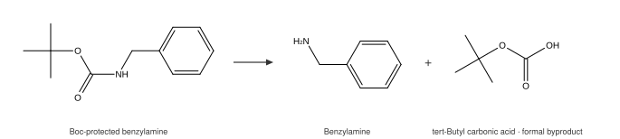

# Byproduct reconstruction

Reaction records usually keep only the major product. An acid and an alcohol
make an ester and the record says *ester* — the water is gone. Templates behave
the same way: they rewrite what they were written to rewrite and drop the rest.

omgkit can put those atoms back.



*What comes back is the **formal** byproduct: the balanced molecule. For Boc
deprotection that is tert-butyl carbonic acid — not the carbon dioxide and
isobutylene you actually isolate. See [what you get is the formal
byproduct](#what-you-get-is-the-formal-byproduct) below.*

```pycon
>>> acid = omgkit.parse_smiles("CC(=O)O"); acid.sanitize()
>>> amine = omgkit.parse_smiles("CCN"); amine.sanitize()
>>> rxn = omgkit.parse_reaction("[C:1](=[O:2])[OH].[N:3]>>[C:1](=[O:2])[N:3]")
>>> out = rxn.run([acid, amine], byproducts=True)[0]
>>> [p.to_canonical_smiles() for p in out.byproducts]
['O']
>>> out.byproduct_verdict
'capped'
>>> out.discarded
[[3], []]
```

## Fact and inference are kept apart

| | What it is |
|---|---|
| `discarded` | **fact** — `discarded[i]` lists the atoms of input *i* that entered no product |
| `byproducts` | **inference** — those atoms closed into real molecules |
| `byproduct_verdict` | how they were closed, or why they could not be |
| `byproduct_budget` | the atom accounting, so you can check the conclusion yourself |

`discarded` has a value even when reconstruction fails — and that is exactly
when you most want it.

## Reading the verdict

| Verdict | Meaning | Trust |
|---|---|---|
| `'off'` | you did not pass `byproducts=True` | — |
| `'nothing'` | no atoms were discarded | — |
| `'capped'` | closed by adding hydrogens only | **high** — no choices to make |
| `'bonded(n)'` | *n* extra bonds were formed | medium — *which* atoms they join is a heuristic |
| `'unresolved(reason)'` | could not be closed | — |

**When the verdict is `unresolved`, `byproducts` is empty.** Inventing one
would be worse than giving nothing: it would be topologically valid,
sanitizable, and wrong with nothing on its face to show it.

If you need strictness, take only `capped`.

## The budget

```pycon
>>> out.byproduct_budget
{'charge_shift': 0, 'delta_charge': 0, 'delta_h': 2, 'fragment_charge': 0,
 'fragment_hydrogens': 1, 'need': 1, 'open_valence': 1, 'remaining': 0}
```

| Key | Meaning |
|---|---|
| `open_valence` | sum of the **Kekulé** bond orders that were cut — each is one unfilled valence |
| `fragment_hydrogens` / `fragment_charge` | hydrogens and formal charge the fragment already carries |
| `delta_h` | substrate hydrogens minus product hydrogens — the hydrogen count the byproduct must have |
| `delta_charge` | substrate charge minus product charge |
| `need` | `delta_h − fragment_hydrogens` |
| `charge_shift` | `delta_charge − fragment_charge` |
| `remaining` | `open_valence + charge_shift − need` |

Adding a hydrogen fills one open valence; **so does landing a negative charge**
— charge and hydrogen compete for the same slots, which is the part that is
easy to miss. A negative `need` means hydrogens have to be *removed*, and
removing one opens another valence. Whatever valences remain are paired off
into bonds.

Negative, odd, or needing too many bonds, and the answer is `unresolved`.

!!! note "Bond orders are counted after kekulization"

    An aromatic carbon's two ring bonds are one single and one double — three,
    not two. Counting aromatic bonds as one flips the parity and makes the whole
    record look unbalanced.

## What you get is the *formal* byproduct

The budget pins down the **counts**: how many hydrogens, how much charge, how
many bonds. Which two atoms a bond joins, which atom gives up a hydrogen, which
atom carries the charge — those are heuristics. That is what the `capped` /
`bonded(n)` distinction is telling you.

Even with the accounting exactly right, the formal byproduct is not always what
gets isolated:

| Reaction | Formal byproduct | Actually isolated |
|---|---|---|
| Esterification, amide coupling | H₂O | H₂O ✅ |
| Halide substitution | HCl / HBr | same ✅ |
| Wittig | Ph₃P=O | same ✅ |
| Boc deprotection | *tert*-butyl carbonic acid | CO₂ + isobutylene ❌ |
| Cbz deprotection | an α-lactone | CO₂ + toluene ❌ |

The last two are the same shape: the formal byproduct decomposes spontaneously,
and predicting that needs a rule table. Formal byproducts have a hard criterion
behind them — the atom budget. Decomposition rules do not. Mixing the two would
make it impossible to tell which parts were proved and which were guessed.

## Going further

A full balanced reaction database built on this idea, with per-element
verification and a documented failure breakdown, is built with `omgkit` over
USPTO-50k. That corpus is not redistributed here — it is licensed separately and
is far too large for this repository — so the numbers quoted above are
reproducible only against your own copy of it.
