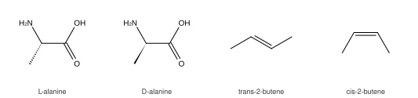
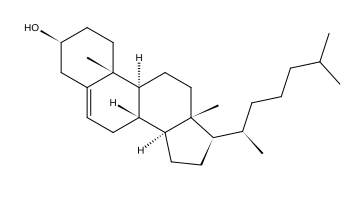
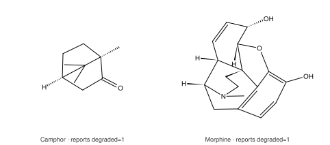

# Drawing structures

`omgkit-depict` turns a molecule into 2D coordinates and then into a picture —
SVG, PNG or JPEG.


*Drawn by the code on this page. Every figure on this site comes from omgkit
itself; the script is
[`docs/figures/make_figures.py`](https://github.com/zbc0315/omgkit/blob/main/docs/figures/make_figures.py).*

!!! note "Rendering is Rust-only; the layout is not"

    Python gets the **layout** through
    [`Mol.to_molblock_2d()`](../api/python.md#omgkit.Mol.to_molblock_2d) — 2D
    coordinates and wedge bonds, written as a `.mol` file. What Python does not
    get is the **rendering** step: `Scene`, SVG, PNG and JPEG are Rust-only, and
    everything below the first section is the Rust API.

```rust
use omgkit_depict::{generate, render::scene, style::Style, svg::to_svg};

let mut m = omgkit_io::smiles::parse("CC(=O)Oc1ccccc1C(=O)O").unwrap();
omgkit_chem::pipeline::sanitize(&mut m).unwrap();
// Double-bond geometry is perceived separately — see below
omgkit_io::stereo::perceive_bond_stereo(&mut m);

let d = generate(&m, &Style::ACS_1996);
let s = scene(&m, &d, &Style::ACS_1996);
std::fs::write("aspirin.svg", to_svg(&s, &Style::ACS_1996)).unwrap();
```

For PNG and JPEG, enable the `raster` feature:

```toml
omgkit-depict = { version = "0.0.6", features = ["raster"] }
```

```rust
use omgkit_depict::raster;

// scale is relative to points, so 300/72 gives 300 dpi
std::fs::write("aspirin.png", raster::to_png(&s, &style, 300.0 / 72.0)?)?;
std::fs::write("aspirin.jpg", raster::to_jpeg(&s, &style, 300.0 / 72.0, 92)?)?;
```

Prefer PNG. A structure is thin lines and small type — exactly what JPEG is
worst at. `to_jpeg` exists because some downstreams accept nothing else.

## Two steps, and why they are not independent

`generate` produces coordinates; `scene` turns coordinates into primitives;
a backend serialises primitives. It is tempting to think coordinates are
style-free — a benzene ring is a regular hexagon whatever font you use.

They are not. **Whether two atoms collide depends on how much room their labels
take**, and the label-to-bond ratio changes with the style:

| | ACS Document 1996 | ChemDraw default |
|---|---|---|
| Bond length | 14.4 pt | 30 pt |
| Atom label | 10 pt | 10 pt |
| **Label as a fraction of one bond** | **69%** | **33%** |

So the same `Style` feeds both steps, and `Depiction` records a fingerprint of
the layout-relevant part of the style it was built with:

```rust
let d = generate(&m, &Style::ACS_1996);
assert!(d.matches(&Style::ACS_1996));
assert!(!d.matches(&Style::CHEMDRAW_DEFAULT));   // caught, not silently cramped
```

The fingerprint covers only what affects layout, so changing a line width or a
font does not invalidate coordinates you already have.

## Styles

Two are built in. Every number is taken from the ChemDraw 17.1 manual, not
tuned by eye.

| | `ACS_1996` | `CHEMDRAW_DEFAULT` |
|---|---|---|
| Bond length | 14.4 pt | 30 pt |
| Line width | 0.6 pt | 1.0 pt |
| Bold width | 2.0 pt | 2.0 pt |
| Margin width | 1.6 pt | 2.0 pt |
| Hash spacing | 2.5 pt | 2.7 pt |
| Double-bond spacing | 18% | 12% |
| Chain angle | 120° | 120° |
| Atom label | 10 pt | 10 pt |

`Style::ALL` iterates both.

## What it promises

These are checked, not asserted in prose. Each one is a judge that was first
shown to go red when the behaviour is broken.

**The picture is decided by the molecule, not by how it was written.** Any
SMILES for the same structure gives point-for-point identical coordinates and
the same set of drawn primitives. Every tie in the layout is broken by
[canonical rank](smiles.md), never by the order atoms happen to be stored in.

**Stereochemistry is not misrepresented.**



Double-bond geometry is corrected
*before* collision relief, and collision relief refuses any flip that would
break it. Wedges are assigned by reading the drawn geometry back and keeping
the one that reproduces the recorded configuration; a wedge records which end
is the narrow one, so two adjacent stereocentres sharing a bond cannot be
confused.

**Bond lengths are all equal, ring double bonds sit inside their ring, sp atoms
are drawn straight (180°), and nothing is drawn outside the canvas.**



*Cholesterol: the fused steroid skeleton, the Δ5 double bond inside its ring,
and all eight stereocentres drawn — the angular methyls as bold wedges, the ring
junction hydrogens as hashes.*

## What it admits it cannot do

Bridged and caged systems have no good planar solution. Crowded substituents
sometimes cannot be separated by the operators available. Rather than quietly
producing a picture whose configuration cannot be read, `Depiction` says so:



*Both of these are drawn, and both report one entry in `degraded`. The report is about
how the layout was reached — ring systems that fell back to spring relaxation —
not a claim that the picture is wrong.*

| Field | Meaning |
|---|---|
| `degraded` | ring systems that fell back to spring relaxation — bond lengths and angles are no longer guaranteed |
| `unresolved` | atom pairs still overlapping after collision relief |
| `crossings` | bond pairs still crossing |
| `unwedged` | stereocentres whose configuration could not be drawn — coordination geometry (`@SP`/`@TB`/`@OH`) is always here, this version cannot draw it |
| `misdrawn_stereo` | double bonds whose **drawn geometry disagrees with the recorded one**. A ring is laid out as a convex polygon, so a double bond inside a ring always comes out *cis*; a *trans* one in an eight-membered-or-larger ring therefore cannot be drawn, and lands here |

```rust
let d = generate(&m, &style);
if !d.is_clean() {
    // your call: render anyway, fall back, or ask a human
}
```

From Python the same five lists come back from
[`Mol.depiction_report()`](../api/python.md#omgkit.Mol.depiction_report):

```pycon
>>> m = omgkit.parse_smiles("C1CCCCCCC/C=C/1"); m.sanitize()
>>> m.depiction_report()["misdrawn_stereo"]      # trans in an eight-ring
[8]
>>> m = omgkit.parse_smiles("CCO"); m.sanitize()
>>> all(v == [] for v in m.depiction_report().values())
True
```

!!! warning "`to_molblock_2d` does not raise on any of these"

    A picture that says something false about the molecule is still a valid
    molblock. If you are writing files that other people will read, check the
    report — nothing else will.

Collision relief only uses **flips** — mirroring one side of a rotatable bond.
That is the only operator that preserves bond lengths and angles exactly.
Opening angles or stretching bonds would fix more pictures at the cost of two
of the guarantees above, so what a flip cannot fix is reported instead of
papered over.

## Prerequisites on the molecule

Sanitize first — ring perception decides how ring systems are grouped, and
kekulization decides which bonds are drawn as double.

Double-bond geometry is perceived by `omgkit_io::stereo::perceive_bond_stereo`,
which is **not part of `sanitize`**. Skip it and every bond's `stereo` is
`None`, so the cis/trans guarantee above checks nothing at all — silently.
(The Python `Mol.sanitize()` does both, so this trap is Rust-only.)

## Seeing what it draws

```shell
# the built-in gallery: 17 molecules × 2 styles × svg/png/jpg
cargo run -p omgkit-depict --release --features raster --example draw -- out/

# or your own
cargo run -p omgkit-depict --release --features raster --example draw -- out/ \
    aspirin='CC(=O)Oc1ccccc1C(=O)O'
```

Each line of output reports the canvas size and the four "could not draw"
counts, so a regression shows up as a number, not as a picture nobody looks at.

To check the half no judge can cover — whether a picture actually reads well —
`harness/compare_rdkit.py` puts omgkit's and RDKit's rendering of the same
molecule side by side at the same bond length.
`harness/make_gallery.py` then binds those into a single `gallery.pdf` so the
whole set can be flipped through in one go — it refuses to run if the manifest
and the images on disk disagree in either direction, and two runs of it are
byte-identical.
