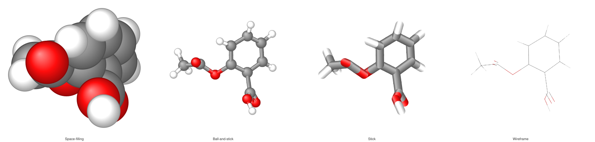
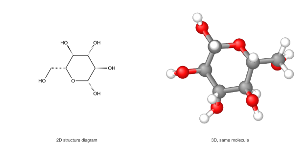
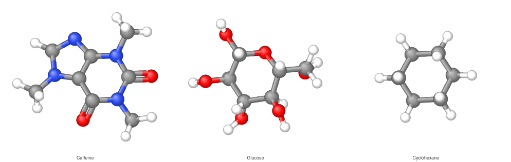
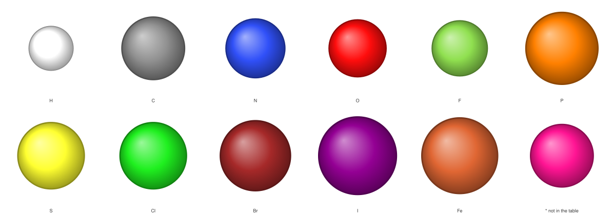
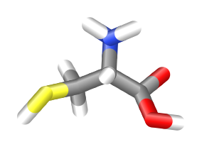

# 3D molecule figures

Give `omgkit-depict` a set of 3D coordinates and it draws the picture chemists
expect — space-filling, ball-and-stick, stick or wireframe, in CPK colours.



*Aspirin, one conformer, four styles. **Same coordinates, same viewpoint** —
only the drawing changes. Every figure on this page is drawn by omgkit itself,
by [`docs/figures/make_figures.py`](https://github.com/zbc0315/omgkit/blob/main/docs/figures/make_figures.py).*

```pycon
>>> import omgkit
>>> conf = omgkit.parse_smiles("CC(=O)Oc1ccccc1C(=O)O").conformer()
>>> svg = conf.to_svg("ball-and-stick")
>>> svg.startswith("<svg")
True
```

The coordinates come from [`Mol.conformer()`](conformers.md) — distance
geometry with no random numbers, so the same molecule always gives the same
picture.

## What a 3D figure shows that a structure diagram cannot

A structure diagram says which atom is bonded to which, and marks configuration
with wedges. It says nothing about shape: every six-membered ring is a flat
hexagon.



*The same glucose. On the left, the ring is a hexagon and the substituents are
wedges; on the right it is a real chair, and you can see which hydroxyls are
axial and which are equatorial.*

The two are complementary, not competing: for reading a reaction scheme you
want the diagram — see [Drawing structures](depict.md).

## The four styles

The names and the radii are not ours. They are Jmol's own *standard rendering
styles*, transcribed:

| `style` | Jmol writes it | Ball radius | Stick radius | What it shows |
|---|---|---|---|---|
| `"space-filling"` | `spacefill 100%` | 100% of the van der Waals radius | — | how much room the molecule takes |
| `"ball-and-stick"` (default) | `wireframe 0.15; spacefill 23%` | 23% vdW | 0.15 Å | bond lengths, angles, configuration |
| `"stick"` | `wireframe 0.3; spacefill off` | same as the stick | 0.30 Å | the skeleton, without clutter |
| `"wireframe"` | `wireframe 0.01; spacefill 0` | — | 0.01 Å | large systems, quick looks |

The van der Waals radii come from the element table omgkit already carries
(Bondi's values, via BODR) — there is no second copy.



!!! warning "Each style carries its own scale — fix it before comparing them"

    `Style3D::scale_pt_per_a` is 24 pt/Å for space-filling and 36 for the other
    three, so that each style comes out a sensible size **on its own**. Put
    them side by side at their own scales and the space-filling panel looks
    like a smaller molecule, which it is not. The figure at the top of this
    page is drawn with all four forced to 36 pt/Å. The library will not do that
    for you.

A style name it does not know is an error, never a silent fallback to the
default:

```pycon
>>> conf.to_svg("ball-n-stick")
Traceback (most recent call last):
    ...
ValueError: 不认识的三维样式 "ball-n-stick";认识的是:space-filling、ball-and-stick、stick、wireframe
```

## Colours

CPK, in Jmol's variant.



*One atom per sphere, in the space-filling style — so the **sizes are real
too**: these are the van der Waals radii at true relative scale. The last
sphere is the SMILES wildcard `*`; its colour means "not in the table" and its
size is a stand-in, not a measurement.*

Elements past meitnerium get the same deep pink. That is a marker, not a claim
about the element, and it is meant to be jarring.

**Each half of a bond takes the colour of the atom it touches**, the way Jmol,
PyMOL, VMD and 3Dmol.js all draw it:



*Cysteine, stick style. Every bond changes colour at its midpoint: C–S grey to
yellow, C–N grey to blue, C–O grey to red. That is what makes a heteroatom
findable in a picture with no labels.*

!!! note "The colour table is a drawing convention, not a physical property"

    It lives in `omgkit_depict::palette`, not in the element table. The same
    carbon is `#909090` in Jmol and `#c8c8c8` in RasMol, while its van der Waals
    radius is 1.7 Å in both. Putting the two in one table invites the next
    reader to think a colour has a correct value.

## The viewpoint

The molecule is turned so that its **principal axes** line up with the screen:
the direction it is most spread out along goes horizontal, the direction it is
least spread out along points at you. This is what PyMOL's `orient` and RDKit's
`ComputeCanonicalTransform` do, and the gate compares our rotation against both
of them, axis by axis.

Two things about it are worth knowing.

**The rotation is never a mirror.** Its determinant is always `+1`. In a 2D
structure diagram mirroring is harmless — configuration is carried by wedges,
which are assigned after the layout is flipped. In a 3D figure the
configuration *is* the coordinates: mirror them and every stereocentre in the
picture is inverted, with nothing on the page to show it. This is checked over
the whole corpus.

**Sometimes the viewpoint carries no information.** When symmetry forces two of
the three principal moments to be equal — methane, carbon tetrachloride,
ammonia, any linear molecule — the two axes involved can be spun freely in
their plane. The picture is not wrong, but its orientation means nothing, so
do not read a pose off it:

```pycon
>>> omgkit.parse_smiles("C").conformer().depiction_3d_report()["degenerate"]
True
>>> conf.depiction_3d_report()["degenerate"]
False
```

Benzene and adamantane, which look symmetric enough to qualify, do **not**:
their generated conformers are a few percent away from ideal, and that is
enough to separate the axes. The measured gaps are in the source, next to the
threshold they set.

The viewpoint depends only on the coordinates, so the four panels at the top of
this page really are one view — a test pins that, and it is what lets them be
read as a comparison.

## What is behind what

SVG has no depth buffer, so the figure is drawn back to front — the painter's
algorithm. Two consequences show up in the output.

Bonds are cut into slices. A stick that runs towards you spans a range of
depths, and sorting a whole stick by one number puts it entirely in front of,
or entirely behind, a sphere it actually passes through. Each half-bond is
therefore sliced until no piece spans more than 0.25 Å of depth.

The part of a bond that is inside its own atom's sphere is not drawn at all.
Without that trim, a bond leaning towards the viewer paints a crescent across
the face of its own atom — the figure looks slightly dirty and nothing reports
an error.

## Where each atom landed

`depiction_3d_report()` gives you the canvas position of every atom, in the
same coordinate system as the SVG, so you can put your own labels or arrows on
top. Reading positions back out of the SVG would be guesswork: circles carry no
atom numbers.

```pycon
>>> rep = omgkit.parse_smiles("CCO").conformer().depiction_3d_report()
>>> sorted(rep["atoms"][0])
['depth', 'radius', 'x', 'y']
>>> rep["style"], len(rep["atoms"])
('ball-and-stick', 9)
```

`x`, `y` and `radius` are in points, on the canvas. `depth` is in ångströms and
counts towards the viewer — the two units differ on purpose, because canvas
position scales with the figure and depth is a property of the molecule.

## What it does not draw

- **No atom labels.** 3D figures identify atoms by colour; a label would need a
  place to go that the geometry does not provide.
- **No perspective.** The projection is orthographic, which is the convention
  for figures in the literature — parallel bonds stay parallel and equal bond
  lengths stay equal.
- **Aromatic bonds get one cylinder.** Double and triple bonds get two and
  three, offset in the plane of the screen the way Jmol draws them; aromatic
  bonds get one. Splitting an aromatic ring into alternating doubles would mean
  picking one Kekulé structure out of several, and a different SMILES for the
  same molecule picks a different one — the double bonds would land on the
  other three edges.

## The Rust API

```rust
use omgkit_depict::three::{self, Style3D};

let mut m = omgkit_io::smiles::parse("CC(=O)Oc1ccccc1C(=O)O")?;
let conf = omgkit_conf::pipeline::conformer_for(&mut m)?;

let d = three::depict(&m, &conf.coords, &Style3D::BALL_AND_STICK)?;
assert!(d.is_clean());                       // the viewpoint is determined
let svg = omgkit_depict::svg::to_svg(&d.scene, &omgkit_depict::style::Style::ACS_1996);
```

`Style3D` has public fields, so overriding one is a struct update — this is how
the four panels above were forced to a common scale:

```rust
let style = Style3D { scale_pt_per_a: 36.0, ..Style3D::SPACE_FILLING };
```

`to_svg` takes a 2D `Style` because it is one serialiser for both paths. A 3D
scene contains no text primitives, so the only field it could read is never
reached — the two built-in styles produce byte-identical output, and a test
pins that.

For PNG, enable the `raster` feature and hand the same scene to
`raster::to_png`; it goes through the SVG, so the geometry is computed once.

`depict` takes coordinates rather than a `Conformer`, so a structure read from
a 3D `.mol` file works the same way. It does **not** add hydrogens: in a 3D
figure hydrogens are visible objects, and whether to include them is the
caller's decision. `conformer_for` adds them; a molblock has whatever it has.

To see the four styles for a molecule of your own:

```shell
cargo run -p omgkit-depict --release --features raster --example draw3d -- out/ \
    morphine='CN1CC[C@]23[C@@H]4[C@H]1CC5=C2C(=C(C=C5)O)O[C@H]3[C@H](C=C4)O'

# side by side? force one scale
cargo run -p omgkit-depict --release --features raster --example draw3d -- out/ \
    --scale=36 morphine='CN1CC[C@]23[C@@H]4[C@H]1CC5=C2C(=C(C=C5)O)O[C@H]3[C@H](C=C4)O'
```

Each line of output reports the canvas size, the primitive count and whether
the viewpoint came out degenerate, so a regression shows up as a number rather
than as a picture nobody looks at.

## How this is checked

`harness/check_depict3d.py` takes the SVG the library actually emits, reads the
circles and lines back out of it, and recomputes what they should have been —
from the coordinates, the rotation matrix, RDKit's van der Waals radii and
Jmol's colour table. It never reads a number the library computed for it.

Over 400 molecules × 4 styles it checks that the rotation is a rotation and
agrees with both numpy's and RDKit's principal axes; that the circles are an
orthographic projection of the coordinates; that every radius and colour is
what the style and the element say; that of two overlapping spheres the nearer
one is drawn later; that each half-bond carries its own atom's colour; that
multiple-bond cylinders are offset perpendicular to the projected bond; and
that renumbering the atoms leaves the SVG byte-identical.

Each of those was calibrated by breaking it: recolouring carbon RasMol grey,
moving the ball radius from 23% to 25%, reversing the depth sort, flipping the
determinant, colouring both halves of a bond alike, offsetting multiple bonds
in the wrong plane, and summing the second moments in storage order instead of
by coordinate. All seven turn the gate red.
