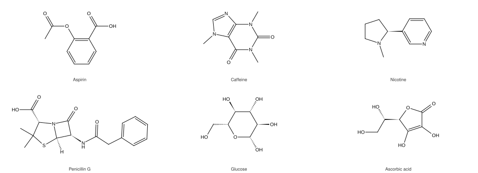

# omgkit

A cheminformatics toolkit written in Rust, with Python bindings.



*Every structure on this site was drawn by omgkit itself — no other chemistry
library is involved. The script that produces them is
[`docs/figures/make_figures.py`](https://github.com/zbc0315/omgkit/blob/main/docs/figures/make_figures.py).*

```python
import omgkit

m = omgkit.parse_smiles("OC(=O)c1ccccc1N")
m.sanitize()
m.to_canonical_smiles()          # 'c1cccc(c1C(O)=O)N'
```

!!! warning "Status: under development"

    The API still changes between commits. Every layer is checked against an
    external reference implementation record by record, but the surface is not
    yet stable enough for production use. Bug reports are welcome.

## What it does

| | |
|---|---|
| **Read and write SMILES** | Tetrahedral chirality, double-bond geometry, dative bonds, explicit hydrogens, canonical output |
| **Sanitize** | Valence, implicit hydrogens, ring perception, kekulization, aromaticity, conjugation, hybridization |
| **Match substructures** | SMARTS parsing, VF2++-style ordering, optionally stereo-aware, SMARTS writing for molecules and reactions |
| **Apply reaction templates** | Product generation with optional atom-atom mapping |
| **Reconstruct byproducts** | The water an esterification drops, rebuilt as a real molecule — or an explicit *cannot tell* when the record itself does not balance |
| **Read and write `.mol` / `.sdf`** | V2000 molblocks and multi-record SDF, in 2D and 3D, with stereochemistry read and written both ways |
| **Draw structures** | 2D coordinates and SVG/PNG/JPEG output, in two drawing styles — with an explicit report of anything it could not draw well |
| **Generate 3D structures** | One deterministic conformer per molecule — no random seed, no retry loop |
| **Work in batches** | A columnar `MolBatch` with zero-copy per-molecule views |

## What makes it different

**A molecule's properties are decided by the molecule, not by how someone chose
to write it down.** Two SMILES strings for the same structure must sanitize to
the same thing, match the same queries, and react the same way. That sounds
obvious; it is where a surprising number of edge cases hide, and it is the
invariant every layer here is checked against.

Three consequences you can see from the outside:

**Product count comes from the graph, not from the template.** A reaction
template rewrites one graph. How many product molecules come out is decided by
how many connected components that rewritten graph has — not by how many
product templates the author happened to write. This is a
[deliberate divergence](dev/correctness.md#a-deliberate-divergence) from the
common implementation, and it is why applying a template that cuts a ring bond
does not silently duplicate atoms.

**Discarded atoms are accounted for.** When a template drops fragments, omgkit
records exactly which atoms were dropped, and can close them into balanced
byproduct molecules. When the record does not balance — a reducing agent
missing from the reaction, say — it says so explicitly instead of guessing.

**3D structures without a retry loop.** Generating one conformer is
deterministic — no random seed, no `10×N` re-draws when a randomly sampled
distance table turns out to be unsatisfiable. On the same 8831-molecule corpus,
RDKit ETKDGv3 2025.09.2 fails on 36 molecules (0.41%) and omgkit on 1 (0.01%).
See [3D structures](guide/conformers.md).

**Every claim has a judge behind it.** Correctness is not asserted, it is
checked record by record against an external implementation, and each judge has
to prove it does not pass vacuously. The whole suite runs on every push. See
[Correctness](dev/correctness.md).

## Install

=== "Python"

    ```shell
    pip install omgkit
    ```

    One wheel covers Python 3.9 and up, and there are no system dependencies.

=== "Rust"

    ```toml
    [dependencies]
    omgkit-core   = "0.0.1"
    omgkit-io     = "0.0.1"
    omgkit-chem   = "0.0.1"
    omgkit-match  = "0.0.1"

    # not on crates.io yet — take them from git
    omgkit-depict = { git = "https://github.com/zbc0315/omgkit" }
    omgkit-conf   = { git = "https://github.com/zbc0315/omgkit" }
    ```

Take only the layers you need; each depends only on the ones below it.
Full instructions in [Installation](getting-started/install.md).

## Where to go next

<div class="grid cards" markdown>

- **[Quickstart](getting-started/quickstart.md)** — parse, sanitize, match and
  react in five minutes
- **[Guides](guide/index.md)** — one page per capability, task first
- **[Python API](api/python.md)** — every callable, with signatures
- **[Developing](dev/index.md)** — build, test, and the full pre-push gate suite

</div>

## License

[BSD-3-Clause](https://github.com/zbc0315/omgkit/blob/main/LICENSE). Test
corpora and the element table are redistributed from other projects and carry
their own terms; each file is traced to its origin in
[`THIRD-PARTY-NOTICES.md`](https://github.com/zbc0315/omgkit/blob/main/THIRD-PARTY-NOTICES.md).
